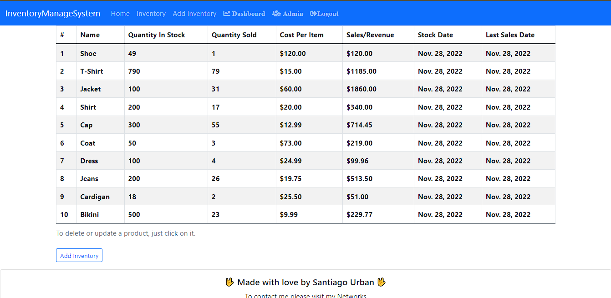

# Django Manage System
## You can visit the site at : http://3.93.195.65/inventory/  (AWS EC2)
### To see de website use, User: testing , Password: 1234test
_This project is a stock controller with different attractive data for customers, with a dashboard that graphs that data_



## Built with🛠️
* [Django](https://www.djangoproject.com/) For the backend
* numpy and pandas For the graphics

## Instructions📋:
_How to get a copy of the project running on your local machine_
<strong>1.Clone the repository</strong>
```
git clone https://github.com/santiudev/DjangoIMS.git
```
<strong>2.Create a virtual environment</strong>
_From the cloned directory run:_
```
python -m venv env
```
<strong>3.Activate the virtualenv</strong>
On macOs or Linux:
```
source venv/bin/activate
```
On Windows:
```
env\scripts\activate
```
<strong>3.Install required requirements</strong>
```
pip install -r requirements.txt
```
## Remember:
You have to configure your secret key and your Email settings.

<strong>4.Run migrations</strong>
```
python manage.py makemigrations
```
```
python manage.py migrate
```
<strong>5.Create an admin User</strong>
```
python manage.py createsuperuser
```
<strong>5.Run the application</strong>
```
python manage.py runserver
```
